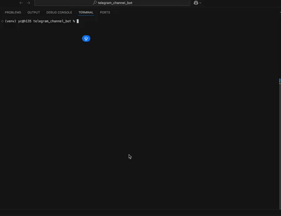

# LLM Daily - Telegram Knowledge Base CLI

> 输入链接，自动解析内容，生成双语摘要和标签，一键发布到 Telegram 频道
>
> Input a link, auto-parse content, generate bilingual summaries and tags, publish to Telegram with one click

**Language / 语言**: [中文](#中文) | [English](#english)

---

# 中文

输入链接 → 自动解析内容 → 生成双语摘要和标签 → 一键发布到 Telegram 频道



**输出示例：**

```
输入: https://arxiv.org/abs/2312.xxxxx


输出到 Telegram:
📌 稳定大语言模型强化学习：公式化方法与实践

📅 2024-12-01

📝 本文提出了一种新颖的大语言模型强化学习公式...

🔗 https://arxiv.org/abs/2312.xxxxx

🏷️ #论文 #Paper #大语言模型 #LLM #强化学习 #RL

────────────────────

📌 Stabilizing Reinforcement Learning with LLMs: Formulation and Practices

📅 2024-12-01

📝 This paper proposes a novel formulation for RL with LLMs...

🔗 https://arxiv.org/abs/2312.xxxxx

🏷️ #Paper #paper #LLM #llm #RL #rl
```

## 支持的链接类型

| 类型 | 状态 | 说明 |
|------|------|------|
| ArXiv | ✅ 已支持 | 自动提取论文标题、摘要、发布日期 |
| 微信公众号 | ✅ 已支持 | 解析文章内容 |
| 通用网页 | ✅ 已支持 | 自动提取正文内容 |
| 知乎 | ⚠️ 受限 | 有反爬保护，建议手动复制内容使用文本模式 |
| GitHub | 🚧 计划中 | 解析 README、仓库信息 |
| HuggingFace | 🚧 计划中 | Papers、Models、Datasets |
| 小红书 | 🚧 计划中 | 笔记内容 |
| Twitter/X | 🚧 计划中 | 推文内容 |

## 核心功能

- **自动解析**: 输入链接，自动抓取网页内容
- **双语输出**: LLM 生成中英文标题和摘要
- **智能标签**: 从预设标签匹配 + 自动生成新标签
- **日期提取**: 自动提取文章发布日期
- **一键发布**: 确认后直接发布到 Telegram 频道

## 安装

```bash
git clone https://github.com/0xPabloxx/telegram_knowledge_base_agent.git
cd telegram_knowledge_base_agent

python3 -m venv venv
source venv/bin/activate

pip install -e .
```

## 配置

创建 `.env` 文件：

```bash
# Telegram
KB_TELEGRAM_BOT_TOKEN=your_bot_token
KB_TELEGRAM_CHANNEL_ID=@your_channel

# LLM (支持: deepseek, openai, gemini, anthropic, kimi, minimax, glm)
KB_LLM_PROVIDER=deepseek
DEEPSEEK_API_KEY=your_api_key

# 预设标签
KB_PRESET_TAGS=Paper,LLM,Agent,Research,Tutorial
```

## 使用

### CLI 模式（电脑端）

```bash
source venv/bin/activate
kb
```

然后输入链接即可：
```
▶ 有什么想收藏的？
https://arxiv.org/abs/2312.xxxxx
```

### Bot 模式（手机端）

通过 Telegram Bot 在手机上发送链接，自动解析并发布到频道。

#### 1. 额外配置

在 `.env` 中添加：

```bash
# 你的 Telegram User ID（在 Telegram 搜索 @userinfobot 获取）
KB_BOT_ADMIN_USER_ID=123456789

# 发布模式: false=预览确认, true=直接发布
KB_BOT_AUTO_PUBLISH=false
```

#### 2. 启动 Bot

```bash
source venv/bin/activate
kb-serve
```

#### 3. 使用方式

在手机上打开你的 Bot，发送链接：
1. Bot 自动解析并生成双语摘要
2. 点击按钮选择标签
3. 点击「发布」发送到频道

**Bot 命令：**
- `/start` - 开始使用
- `/mode` - 切换「直接发布」/「预览确认」模式
- `/cancel` - 取消当前操作
- `/help` - 帮助信息

#### 4. 持久化运行

**方法 A：后台运行（简单）**

```bash
nohup kb-serve > ~/kb-bot.log 2>&1 &
```

查看日志：`tail -f ~/kb-bot.log`

停止服务：`pkill -f kb-serve`

**方法 B：macOS 开机自启（推荐）**

1. 创建 launchd 配置文件：

```bash
cat > ~/Library/LaunchAgents/com.kb.bot.plist << 'EOF'
<?xml version="1.0" encoding="UTF-8"?>
<!DOCTYPE plist PUBLIC "-//Apple//DTD PLIST 1.0//EN" "http://www.apple.com/DTDs/PropertyList-1.0.dtd">
<plist version="1.0">
<dict>
    <key>Label</key>
    <string>com.kb.bot</string>
    <key>ProgramArguments</key>
    <array>
        <string>/bin/bash</string>
        <string>-c</string>
        <string>source /Users/YOUR_USERNAME/Projects/telegram_channel_bot/venv/bin/activate && kb-serve</string>
    </array>
    <key>WorkingDirectory</key>
    <string>/Users/YOUR_USERNAME/Projects/telegram_channel_bot</string>
    <key>RunAtLoad</key>
    <true/>
    <key>KeepAlive</key>
    <true/>
    <key>StandardOutPath</key>
    <string>/Users/YOUR_USERNAME/Library/Logs/kb-bot.log</string>
    <key>StandardErrorPath</key>
    <string>/Users/YOUR_USERNAME/Library/Logs/kb-bot.error.log</string>
    <key>EnvironmentVariables</key>
    <dict>
        <key>PATH</key>
        <string>/usr/local/bin:/usr/bin:/bin</string>
    </dict>
</dict>
</plist>
EOF
```

> 注意：将 `YOUR_USERNAME` 替换为你的用户名

2. 加载服务：

```bash
launchctl load ~/Library/LaunchAgents/com.kb.bot.plist
```

3. 常用命令：

```bash
# 启动
launchctl start com.kb.bot

# 停止
launchctl stop com.kb.bot

# 卸载（停止并移除自启）
launchctl unload ~/Library/LaunchAgents/com.kb.bot.plist

# 查看日志
tail -f ~/Library/Logs/kb-bot.log
```

---

# English

Input a link → Auto-parse content → Generate bilingual summaries & tags → Publish to Telegram

**Output Example:**

```
Input: https://arxiv.org/abs/2312.xxxxx

Output to Telegram:
📌 Chinese Title (auto-translated)

📅 2024-12-01

📝 Chinese summary...

🔗 https://arxiv.org/abs/2312.xxxxx

🏷️ #Chinese #Tags

────────────────────

📌 English Title

📅 2024-12-01

📝 English summary...

🔗 https://arxiv.org/abs/2312.xxxxx

🏷️ #English #Tags
```

## Supported Link Types

| Type | Status | Description |
|------|--------|-------------|
| ArXiv | ✅ Supported | Auto-extract paper title, abstract, date |
| WeChat Articles | ✅ Supported | Parse article content |
| General Web | ✅ Supported | Auto-extract main content |
| Zhihu | ⚠️ Limited | Anti-scraping protection, use text mode instead |
| GitHub | 🚧 Planned | Parse README, repo info |
| HuggingFace | 🚧 Planned | Papers, Models, Datasets |
| Xiaohongshu | 🚧 Planned | Note content |
| Twitter/X | 🚧 Planned | Tweet content |

## Core Features

- **Auto-parsing**: Input a link, automatically scrape web content
- **Bilingual Output**: LLM generates Chinese and English titles/summaries
- **Smart Tags**: Match from presets + auto-generate new tags
- **Date Extraction**: Auto-extract article publish date
- **One-click Publish**: Publish to Telegram channel after confirmation

## Installation

```bash
git clone https://github.com/0xPabloxx/telegram_knowledge_base_agent.git
cd telegram_knowledge_base_agent

python3 -m venv venv
source venv/bin/activate

pip install -e .
```

## Configuration

Create `.env` file:

```bash
# Telegram
KB_TELEGRAM_BOT_TOKEN=your_bot_token
KB_TELEGRAM_CHANNEL_ID=@your_channel

# LLM (supports: deepseek, openai, gemini, anthropic, kimi, minimax, glm)
KB_LLM_PROVIDER=deepseek
DEEPSEEK_API_KEY=your_api_key

# Preset Tags
KB_PRESET_TAGS=Paper,LLM,Agent,Research,Tutorial
```

## Usage

### CLI Mode (Desktop)

```bash
source venv/bin/activate
kb
```

Then input a link:
```
▶ What do you want to save?
https://arxiv.org/abs/2312.xxxxx
```

### Bot Mode (Mobile)

Use Telegram Bot on your phone to send links, auto-parse and publish to channel.

#### 1. Additional Configuration

Add to `.env`:

```bash
# Your Telegram User ID (search @userinfobot on Telegram to get it)
KB_BOT_ADMIN_USER_ID=123456789

# Publish mode: false=preview & confirm, true=auto publish
KB_BOT_AUTO_PUBLISH=false
```

#### 2. Start Bot

```bash
source venv/bin/activate
kb-serve
```

#### 3. How to Use

Open your Bot on phone, send a link:
1. Bot auto-parses and generates bilingual summary
2. Click buttons to select tags
3. Click "Publish" to send to channel

**Bot Commands:**
- `/start` - Get started
- `/mode` - Toggle "auto publish" / "preview & confirm" mode
- `/cancel` - Cancel current operation
- `/help` - Help info

#### 4. Keep Running

**Method A: Background Run (Simple)**

```bash
nohup kb-serve > ~/kb-bot.log 2>&1 &
```

View logs: `tail -f ~/kb-bot.log`

Stop service: `pkill -f kb-serve`

**Method B: macOS Auto-start (Recommended)**

1. Create launchd config file:

```bash
cat > ~/Library/LaunchAgents/com.kb.bot.plist << 'EOF'
<?xml version="1.0" encoding="UTF-8"?>
<!DOCTYPE plist PUBLIC "-//Apple//DTD PLIST 1.0//EN" "http://www.apple.com/DTDs/PropertyList-1.0.dtd">
<plist version="1.0">
<dict>
    <key>Label</key>
    <string>com.kb.bot</string>
    <key>ProgramArguments</key>
    <array>
        <string>/bin/bash</string>
        <string>-c</string>
        <string>source /Users/YOUR_USERNAME/Projects/telegram_channel_bot/venv/bin/activate && kb-serve</string>
    </array>
    <key>WorkingDirectory</key>
    <string>/Users/YOUR_USERNAME/Projects/telegram_channel_bot</string>
    <key>RunAtLoad</key>
    <true/>
    <key>KeepAlive</key>
    <true/>
    <key>StandardOutPath</key>
    <string>/Users/YOUR_USERNAME/Library/Logs/kb-bot.log</string>
    <key>StandardErrorPath</key>
    <string>/Users/YOUR_USERNAME/Library/Logs/kb-bot.error.log</string>
    <key>EnvironmentVariables</key>
    <dict>
        <key>PATH</key>
        <string>/usr/local/bin:/usr/bin:/bin</string>
    </dict>
</dict>
</plist>
EOF
```

> Note: Replace `YOUR_USERNAME` with your actual username

2. Load the service:

```bash
launchctl load ~/Library/LaunchAgents/com.kb.bot.plist
```

3. Common commands:

```bash
# Start
launchctl start com.kb.bot

# Stop
launchctl stop com.kb.bot

# Unload (stop and remove auto-start)
launchctl unload ~/Library/LaunchAgents/com.kb.bot.plist

# View logs
tail -f ~/Library/Logs/kb-bot.log
```

---

## Supported LLM Providers

| Provider | Model |
|----------|-------|
| DeepSeek | deepseek-chat |
| OpenAI | gpt-4o-mini |
| Anthropic | claude-3-5-sonnet |
| Google Gemini | gemini-1.5-flash |
| Kimi | moonshot-v1-8k |
| MiniMax | abab6.5s-chat |
| GLM | glm-4-flash |

## License

MIT
